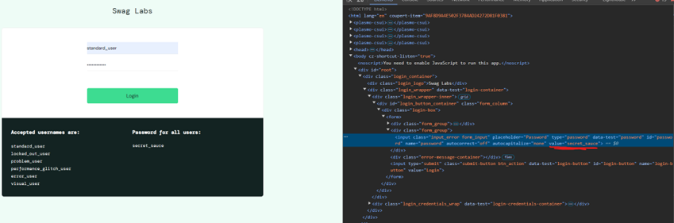
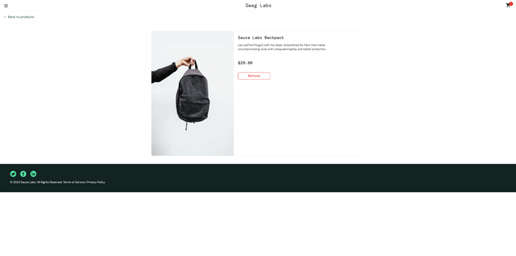
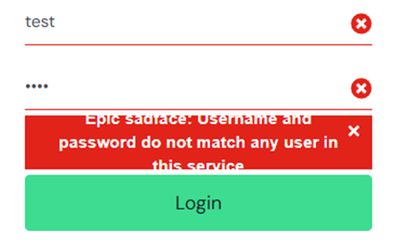
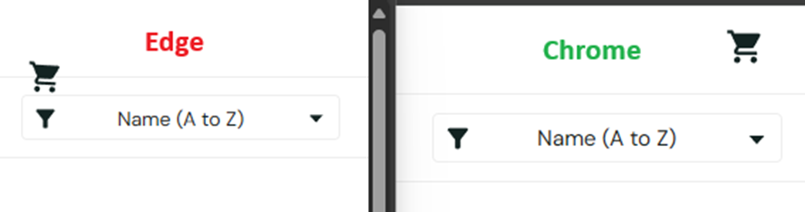

# Bug Report

#### Bugs ordered by priority high-low

## Bug 1: Checkout Input Validation
#### **Summary**: 
- Input fields in the checkout process accept invalid data (e.g., spaces, alphanumeric zip codes).
#### **Severity**: High
#### **Priority**: High
#### **Steps to Reproduce**:
  1. Navigate to the checkout page.
  2. Enter invalid data in the "First Name", "Last Name", or "Zip/Postal Code" fields.
  3. Proceed to checkout.
#### **Expected Result**: 
- Input validation should reject invalid data.
#### **Actual Result**: 
-  It’s possible to checkout with no products in the cart.
- Inputs are not validated at all in First Name, Last Name, Zip/Postal Code – the user can enter a “space” character, and it is accepted.
- Zip/Postal code can contain alphanumerical characters, it should only be numerical.
- There are no limits on input fields, for example the user can enter a first or last name with as many characters as they want.
Invalid data is accepted.

## Bug 2: Checkout Successful transactions
#### **Summary**: 
- Completed transactions have no record and are not saved.
#### **Severity**: High
#### **Priority**: High
#### **Steps to Reproduce**:
  1. Add items to cart
  2. Complete checkout process
#### **Expected Result**: 
- Successful transactions should be recorded for users to access later and for record keeping.
#### **Actual Result**: 
- Successful transactions are not recorded in an Accounts section or a My Orders section, this is currently not present.

## Bug 3: 
#### **Summary**: 
- There is no input validation on any input fields, leaving vulnerabilities to injections.
#### **Severity**: High
#### **Priority**: High
#### **Potential Risk**:
  - Currently not producable, as no input fields save data, but if successful transactions were processed genuinely as per Bug 2, this would need to be fixed.
#### **Expected Result**: 
- Input validation should reject invalid/malicious data.
#### **Actual Result**: 
- There is no input validation, users can enter any data they want.

## Bug 4: 
#### **Summary**: 
- Login concurrency is currently possible for a single user.
#### **Severity**: Medium
#### **Priority**: Medium
#### **Steps to Reproduce**:
  1. Log in as standard_user
  2. Open another browser, or incognito tab and log in as the same user
  3. Observe both users are able to perform actions without resulting in a signout. 
#### **Expected Result**: 
- Only one instance of a unique user should be able to log in at a time to prevent session hijacking or token theft.
#### **Actual Result**: 
- Multiple instances of a single user can log in concurrently.

## Bug 5: 
#### **Summary**: 
- User's username and password are visible in HTML 
#### **Severity**: Medium
#### **Priority**: Medium
#### **Steps to Reproduce**:
  1. On the login page, enter a username and password, but don't log in
  2. Inspect the HTML of the username and password fields
  3. Observe the username and more importantly, the password, are visible in plain text.
#### **Expected Result**: 
- Username and password should never be stored or visible in the HTML.
#### **Actual Result**: 
- Username and password are visible in the HTML of the webpage.

## Bug 6: 
#### **Summary**: 
- Cart page does not allow quantity adjustments 
#### **Severity**: Low
#### **Priority**: Medium
#### **Steps to Reproduce**:
  1. Add an item to your cart
  2. Navigate to the cart page
  3. Observe the quantity of the item in the cart is not adjustable
#### **Expected Result**: 
- Cart quantities should be adjustable from inside the cart page
#### **Actual Result**: 
- Cart quantities are not adjustable from inside the cart page 

## Bug 7:
#### **Summary**: 
- Site is missing key accessibility features
#### **Severity**: Low
#### **Priority**: Medium
#### **Steps to Reproduce**:
  1. Observed during general testing.
#### **Expected Result**: 
- Site should contain the following:
    -	alt tags on images
    - Text descriptions for icons
    - Accessibility via pressing Tab, Arrow Keys and Enter
    - High contrast/readable fonts
    - Scalability via zoom
    - Label elements on form fields

#### **Actual Result**: 
- Site elements are not accessible via Tab to select, Arrow Keys to move and Enter to interact (with the exception of the login page).
- Shopping cart icon is missing a text description.
- No label elements on form fields.
- Other points working as intended.

## Bug 8: 
#### **Summary**: 
- Site images are not appearing correctly on mobile
#### **Severity**: Low
#### **Priority**: Low
#### **Steps to Reproduce**:
  1. Log in to the site on a mobile device
  2. Observe the images are squished vertically
#### **Expected Result**: 
- Site should function on mobile as it does on desktop
#### **Actual Result**:
- Site functions correctly, but images appear squished vertically on mobile devices.

## Bug 9: 
#### **Summary**:
- Footer appears incorrectly on product page
#### **Severity**: Low
#### **Priority**: Low
#### **Steps to Reproduce**:
  1. Log in to site
  2. Navigate to any product page
  3. Observe the footer is not at the bottom of the page
#### **Expected Result**: Footer should be stuck to the bottom of the page, regardless of zoom or resolution.
#### **Actual Result**: Footer is not stuck to the bottom of the page. 

## Bug 10: 
#### **Summary**: 
- Error message on login screen does not fit in it's container
#### **Severity**: Low
#### **Priority**: Low
#### **Steps to Reproduce**:
  1. Trigger any error on the log in screen, for example incorrect password
  2. Observe the error message is too large for it's container.
#### **Expected Result**: Error message should fit inside the container
#### **Actual Result**: Error message does not fit inside the container

## Bug 11: 
#### **Summary**: Incorrect positioning of Cart icon in Microsoft Edge
#### **Severity**: Low
#### **Priority**: Low
#### **Steps to Reproduce**:
  1. Log in to site in Chrome browser
  2. Log in to site in Microsoft Edge browser
  3. Observe the cart icon is positioned differently between the two browsers.
#### **Expected Result**: 
- The Cart icon should have consistent positioning across browsers.
#### **Actual Result**: 
- The Cart icon is incorrectly positioned on Microsoft Edge when compared to Chrome/Firefox

